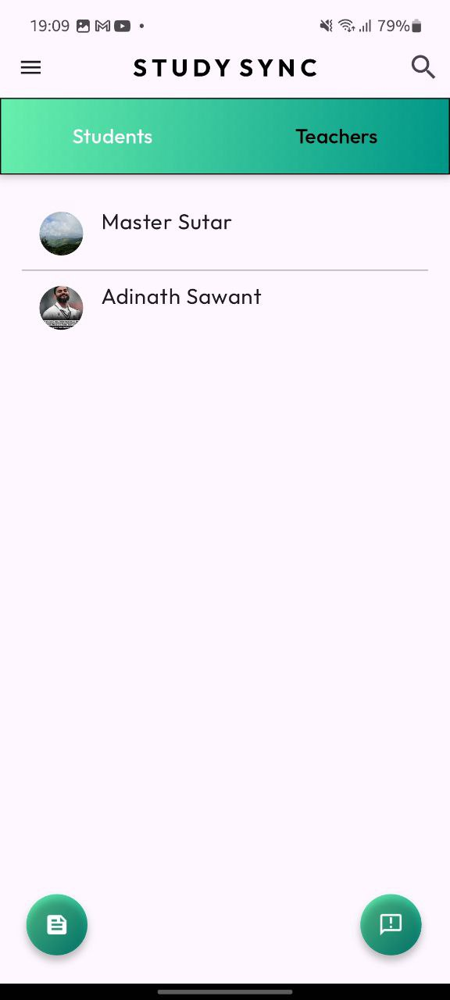
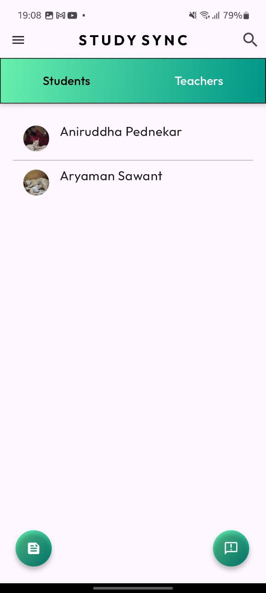
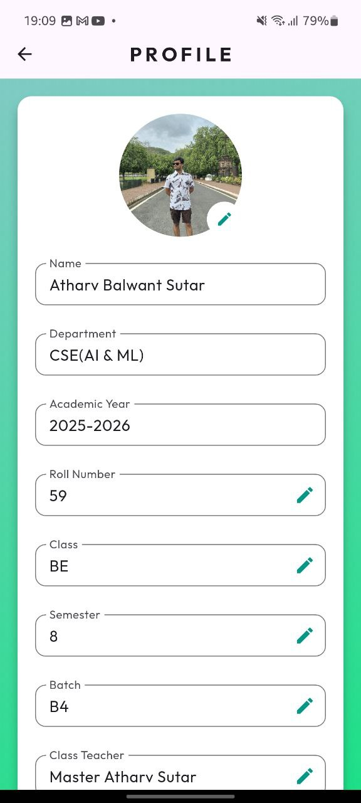
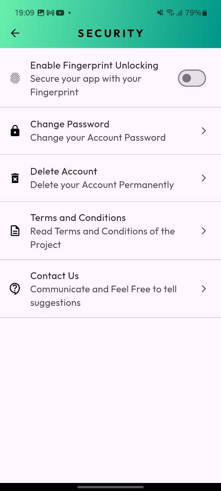
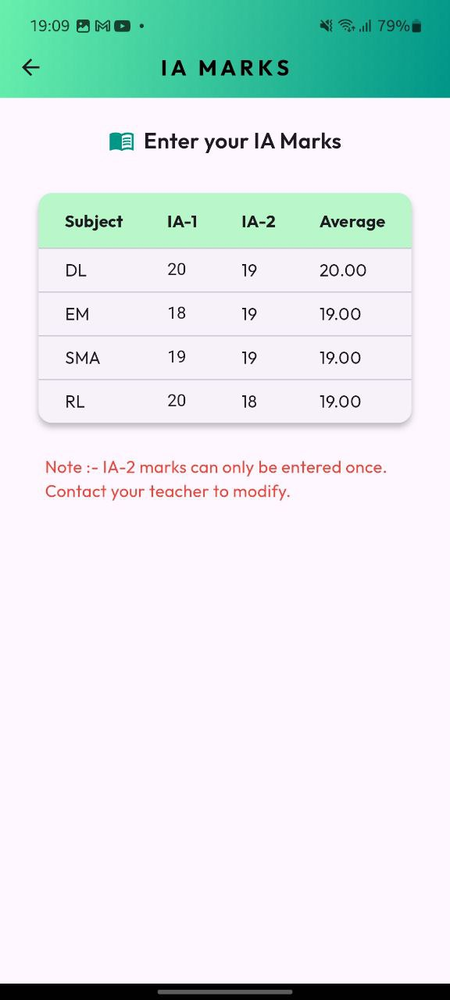
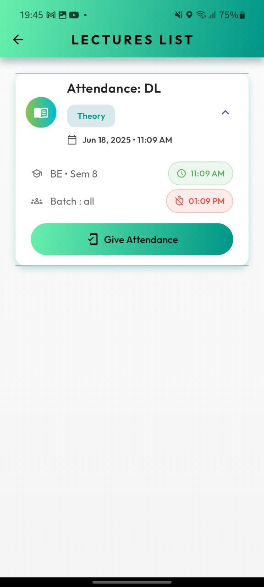

# 📚 StudySync Student

Welcome to **StudySync Student**, your all-in-one academic companion designed to simplify student life by keeping you connected with your teachers, class updates, attendance, and performance insights. StudySync Student is part of the broader **StudySync** ecosystem that enables seamless communication and management between students and educators.

---

## 🚀 Getting Started

This Flutter project gives students a powerful mobile app to monitor their academics, track progress, and access class materials. Whether you’re a student developer or just interested in contributing, this guide will help you get started quickly.

### Prerequisites

Before running the app, ensure you have the following installed:

- [Flutter SDK](https://docs.flutter.dev/get-started/install)
- [Android Studio](https://developer.android.com/studio) or [VS Code](https://code.visualstudio.com/) (with Flutter extension)
- A connected device or emulator

---

## ⚙️ How the App Works

**StudySync Student** provides a rich feature set to help students stay informed and engaged:

- **Personalized Dashboard:** View attendance, performance, and notifications at a glance.
- **Lecture Alerts:** Get real-time notifications for new lectures (theory/lab) and assignments.
- **Attendance Tracker:** Monitor your class attendance by subject and semester.
- **Performance Overview:** Track marks and academic progress across subjects.
- **Optional Subjects & Batches:** View and manage your selected optional subjects and batch preferences.
- **Profile Management:** Update personal and academic information in real time.
- **Resource Access:** View study materials and class announcements shared by teachers.

The app integrates with [Firebase](https://firebase.google.com/) for real-time data sync, ensuring your academic data is always up to date.

---

## 🏃 How to Run It

Follow these steps to get the StudySync Student app running on your local device:

1. **Clone the Repository:**

   ```bash
   git clone https://github.com/ATBlastDon/StudySync_Student.git
   cd StudySync_Student

2. **Install Dependencies:**
   ```bash
   flutter pub get

3. **Configure Firebase:**
   Add your Firebase configuration files (google-services.json for Android and GoogleService-Info.plist for iOS) to the appropriate directories.

4. **Run The App**
   ```bash
   flutter run

---

## 💡 Features

StudySync Student offers a comprehensive range of features for students:

- **Real-time Sync:** Powered by Firebase to instantly reflect updates in attendance, marks, and subject notifications.
- **Live Lecture Notifications:** Receive push updates when a new lecture is scheduled, with optional subject and batch filters applied.
- **Profile Editing:** Update year, semester, batch, academic year, mentor, and roll number with real-time Firestore sync.
- **Interactive UI:** Smooth animations with the `animate_do` package and modern design powered by Material UI.
- **Offline Support:** Cached profile and subject data for smoother experience even with limited connectivity.
- **Batch & Optional Logic:** Customized lecture visibility based on selected optional subjects and assigned batch.
- **Secure Access:** Authentication and role-based features built into the Firebase ecosystem.

---

## 👨‍🏫 About StudySync Teacher

StudySync Teacher is the educator-facing counterpart of this app. It enables:

- **Class Management:** Teachers can manage attendance, approve students, and update marks.
- **Student Insights:** Track performance and generate reports in PDF format.
- **Real-time Interaction:** Notify students of new lectures, assignments, and announcements.

Together, StudySync Student and StudySync Teacher form a connected educational platform for a smarter classroom experience.

---

## 📝 License

This project is licensed under the MIT License – see the [LICENSE](LICENSE) file for details.

---

## 📞 Contact

For feedback, support, or contributions, feel free to reach out:

- **Email:** atharvsutar3102003@gmail.com  
- **GitHub Issues:** [StudySync Student Issues](https://github.com/ATBlastDon/StudySync_Student/issues)

---

## ❤️ Support

If you find this project useful, consider supporting the development:

- [Buy Me a Coffee](https://www.buymeacoffee.com/atblastdon)
- UPI ID: `atanything@ybl`

Thank you for using StudySync Student—your academic progress made smarter!

---

## 🖼️ Screenshots — StudySync Student

Here are some images showcasing **StudySync Student** and its features:

<p float="left">
  
  
  
</p>

<p float="left">
  
  
  
</p>

